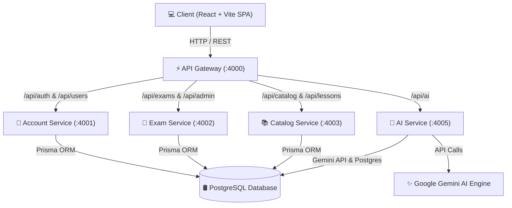

# 🚀 AeroTOEIC - Nền Tảng Luyện Thi TOEIC Thông Minh Tích Hợp AI Tutor ETS 990

<p align="center">
  
  
  
  
  
  
</p>

---

## 📖 Giới Thiệu Dự Án

**AeroTOEIC** là một hệ thống web luyện thi TOEIC trực tuyến toàn diện, hiện đại và thông minh, được xây dựng theo kiến trúc **Microservices** chuẩn công nghiệp. Hệ thống tích hợp trí tuệ nhân tạo **Google Gemini AI (ETS 990 Specialization)** nhằm mang lại trải nghiệm học tập cá nhân hóa sâu sắc cho từng học viên.

Hệ thống hỗ trợ làm bài thi mô phỏng **120 phút với 200 câu hỏi chuẩn ETS (Part 1 ➔ Part 7)**, phân tích chi tiết điểm số, quản lý từ vựng, tự động tạo **Lộ trình học AI Real-time**, cùng công cụ **Import cURL thông minh** cho phép nạp trọn bộ đề thi gốc từ CSDL Supabase chỉ trong vài giây.

---

## ✨ Tính Năng Nổi Bật

### 🎓 Dành Cho Học Viên (Student)
- **Thi thử & Luyện tập chuẩn ETS**: Trải nghiệm giao diện thi 120 phút đầy đủ 200 câu hỏi Listening & Reading. Đồng hồ đếm ngược, chuyển Part nhanh, tự động lưu bài làm real-time.
- **Phân Tích Bảng Điểm TOEIC**: Tự động tính điểm thi theo thang điểm chuẩn ETS (10 - 990 điểm), thống kê tỷ lệ đúng/sai chi tiết theo từng Part và chủ điểm kiến thức.
- **AI Tutor 24/7 (Trợ lý AI ETS 990)**: Chatbot AI giải đáp thắc mắc câu hỏi, phân tích lý do chọn đáp án, dịch nghĩa đoạn văn song ngữ Anh - Việt và đưa ra mẹo tránh bẫy.
- **Lộ Trình Học Cá Nhân Hóa AI (Dynamic AI Roadmap)**: Nhập điểm hiện tại, điểm mục tiêu và thời gian ôn tập. AI sẽ tự động lập lộ trình theo từng ngày, tạo bài học và bộ câu hỏi luyện tập riêng biệt cho mỗi ngày.
- **Bộ Từ Vựng & Ngữ Pháp Chuyên Sâu**: Kho từ vựng TOEIC chia theo chủ đề kèm phát âm, hình ảnh, câu ví dụ và tính năng lưu từ vựng yêu thích.

### 🛡️ Dành Cho Quản Trị Viên (Admin / Manager)
- **Quản Lý Đề Thi 200 Câu**: Bộ biên tập chi tiết 7 Parts với giao diện trực quan, hỗ trợ xem trước và chỉnh sửa câu hỏi, đáp án, bài đọc HTML, link file nghe MP3 và hình ảnh.
- **Tự Động Import Đề cURL Supabase**: Nhập trọn bộ 200 câu hỏi gốc (văn bản câu hỏi, 4 đáp án A-B-C-D, bài đọc, transcript, lời giải chi tiết tiếng Việt, file nghe MP3/ảnh) từ cURL F12 chỉ với 1 cú click. Tự động hỗ trợ mọi định dạng cURL (Windows CMD, PowerShell, Linux, MacOS).
- **Quản Lý Người Dùng & Báo Cáo Statistics**: Thống kê số lượng học viên, đề thi, lượt làm bài và tổng quan hoạt động hệ thống.

---

## 🏗️ Kiến Trúc Hệ Thống (Microservices Architecture)

Hệ thống được chia thành 5 Microservices decoupled hoàn toàn, giao tiếp qua **API Gateway**:



### 🧩 Chi Tiết Các Microservices

| Service Name | Port | Nhiệm Vụ | Công Nghệ |
| :--- | :---: | :--- | :--- |
| **API Gateway** | `4000` | Điều hướng Request, kiểm tra JWT Authentication, CORS, Vòng lặp Keep-Alive 24/7 | Node.js, Express, Http-Proxy-Middleware |
| **Account Service** | `4001` | Đăng ký, Đăng nhập (JWT), Quản lý Hồ sơ Học viên, Google OAuth | Node.js, Express, Prisma, PostgreSQL |
| **Exam Service** | `4002` | Quản lý đề thi 200 câu, Bộ chấm điểm thi thử, Bộ bóc tách Import cURL Supabase | Node.js, Express, Prisma, PostgreSQL |
| **Catalog Service** | `4003` | Quản lý kho bài học, bài tập luyện tập, từ vựng theo chủ đề | Node.js, Express, Prisma, PostgreSQL |
| **AI Service** | `4005` | AI Chatbot, Tạo lộ trình AI Real-time, Chuỗi Fallback Model Gemini (`flash-lite`, `3.1-flash`) | Node.js, Express, Google GenAI SDK |

---

## 🛠️ Công Nghệ Sử Dụng (Tech Stack)

### 🎨 Frontend
- **Framework**: React 18, Vite, TypeScript
- **Styling**: Modern Custom CSS System (Dark Mode, Glassmorphism, Responsive Grid)
- **Icons & UI**: Lucide React Icons

### ⚙️ Backend & Infrastructure
- **Runtime**: Node.js (v18+)
- **Framework**: Express.js
- **ORM**: Prisma ORM
- **Database**: PostgreSQL (Render Cloud / Docker Postgres)
- **AI Engine**: Google Gemini API (`gemini-flash-lite-latest`, `gemini-3.1-flash-lite`)
- **Containerization**: Docker, Docker Compose
- **Deployment**: Render Cloud Platform

---

## 🚀 Hướng Dẫn Cài Đặt & Chạy Tại Local

### 📋 Yêu Cầu Tiên Quyết
- **Node.js**: v18.0.0 trở lên
- **Docker & Docker Compose** (nếu chạy qua Docker)
- **PostgreSQL** (nếu chạy trực tiếp)

---

### 🟢 Cách 1: Chạy Bằng Docker Compose (Khuyên Dùng)

1. **Clone Repository**:
   ```bash
   git clone https://github.com/nuibachcode/web-luyen-thi-toeic.git
   cd web-luyen-thi-toeic
   ```

2. **Cấu Hình Môi Trường (`.env`)**:
   Tạo file `.env` tại thư mục gốc với nội dung:
   ```env
   JWT_SECRET=super-secret-toeic-key
   GEMINI_API_KEY=your_google_gemini_api_key_here
   AUTH_DB_PASSWORD=change-me-auth
   EXAM_DB_PASSWORD=change-me-exam
   CATALOG_DB_PASSWORD=change-me-catalog
   ```

3. **Khởi Chạy Hệ Thống**:
   ```bash
   docker-compose up -d --build
   ```

4. **Nạp 10 Đề Thi Mẫu & Khởi Tạo CSDL (Seed Data)**:
   ```bash
   # Nạp dữ liệu 10 đề thi ETS đầy đủ câu hỏi, audio, lời giải vào CSDL:
   npx tsx seeds/seed_all.ts
   ```

5. **Truy Cập Trang Web**:
   - **Frontend**: `http://localhost:5173` (hoặc qua Vite dev server)
   - **API Gateway**: `http://localhost:4000`
   - **Tài khoản Admin mặc định**: `admin@toeic.com` / `admin123`

---

### 🟡 Cách 2: Chạy Thủ Công (Manual Setup)

1. **Cài Đặt Dependencies & Database**:
   ```bash
   # 1. Cài đặt Frontend
   cd frontend
   npm install
   npm run dev

   # 2. Cài đặt các Backend Service (Account, Exam, Catalog, AI, Gateway)
   cd ../backend/account-service
   npm install && npx prisma db push && npm run dev

   cd ../backend/exam-service
   npm install && npx prisma db push && npm run dev

   cd ../backend/catalog-service
   npm install && npx prisma db push && npm run dev

   cd ../backend/ai-service
   npm install && npm run dev

   cd ../backend/api-gateway
   npm install && npm run dev
   ```

2. **Nạp 10 Đề Thi Vào Database**:
   ```bash
   # Chạy từ thư mục gốc dự án:
   npx tsx seeds/seed_all.ts
   ```

---

## 🌐 Cấu Hình Deployment On Cloud (Render.com)

Hệ thống được cấu hình sẵn cho **Render Cloud Free Tier** thông qua file `render.yaml`:

- **API Gateway**: `https://aerotoeic-api-gateway.onrender.com`
- **AI Service**: `https://aerotoeic-ai-service.onrender.com`
- **Cơ Chế Keep-Alive 24/7**: API Gateway tự động gửi ping ngầm mỗi **4 phút/lần** tới tất cả 4 microservices để ngăn máy chủ miễn phí rơi vào trạng thái ngủ đông (Cold Start).

---

## 📝 Giấy Phép (License)

Dự án được phát hành theo giấy phép **MIT License**. Bạn có thể tự do sử dụng, chỉnh sửa và phát triển.

---

<p align="center">
  Made with ❤️ by <b>DeepMind Coding Assistant & AeroTOEIC Team</b>
</p>
