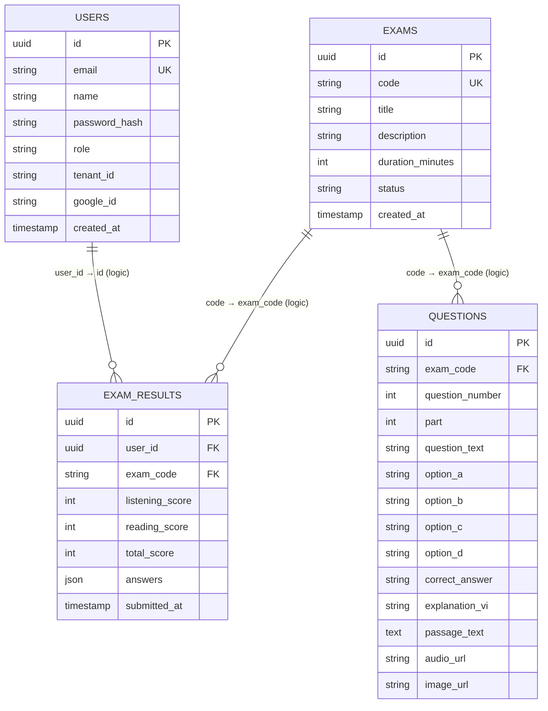
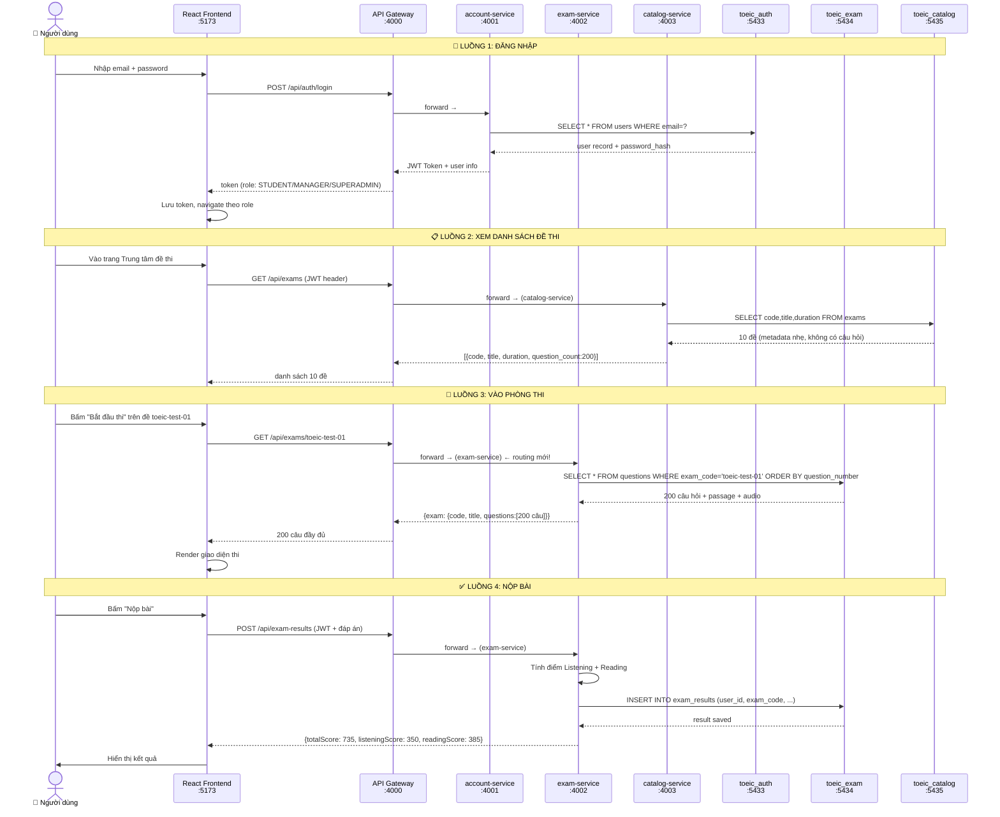

# Sơ đồ Kiến trúc Database & Luồng Hoạt Động

## Bảng thừa đã xóa

| Nơi | Bảng thừa | Lý do thừa | Đã xử lý |
|---|---|---|---|
| `toeic_auth` | `exam_results`, `exams` | Tạo ra do `init-db.sql` chạy trên sai DB | ✅ Đã xóa |
| `toeic_exam` | (đã xóa `exams`, `users` trước đó) | Prisma push đồng bộ sai schema | ✅ Đã xóa |

---

## Sơ đồ cấu trúc DB (sau khi dọn dẹp)



---

## Luồng hoạt động đầy đủ



---

## Fault Isolation — Khi một service bị sập

```mermaid
graph TD
    subgraph "✅ catalog-service SẬP"
        A1[Trang danh sách đề ❌] 
        A2[Đang thi: vẫn OK ✅]
        A3[Đăng nhập: vẫn OK ✅]
        A4[Nộp bài: vẫn OK ✅]
    end

    subgraph "✅ exam-service SẬP"
        B1[Trang danh sách đề: OK ✅]
        B2[Vào phòng thi: thất bại ❌]
        B3[Nộp bài: thất bại ❌]
        B4[Đăng nhập: vẫn OK ✅]
    end

    subgraph "✅ account-service SẬP"
        C1[Đăng nhập mới: thất bại ❌]
        C2[Đang thi (đã login): vẫn OK ✅]
        C3[Nộp bài: vẫn OK ✅]
    end
```

> **Giải thích nguyên tắc:** Mỗi service chỉ biết về DB của mình. Liên kết giữa các bảng khác DB là **liên kết logic** qua `exam_code` (chuỗi "toeic-test-01") và `user_id` (UUID), không phải **Foreign Key vật lý**. Điều này cho phép mỗi DB scale và fail độc lập.
